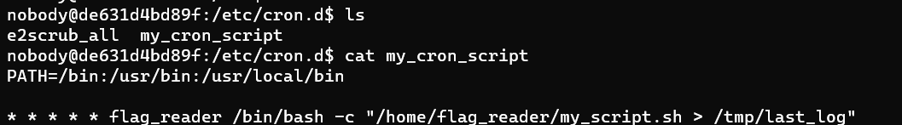
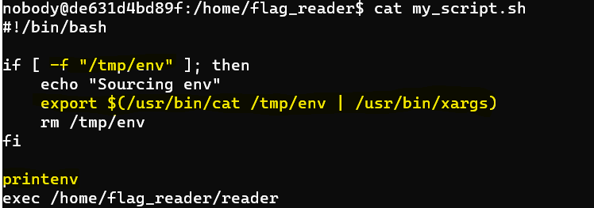
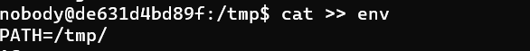
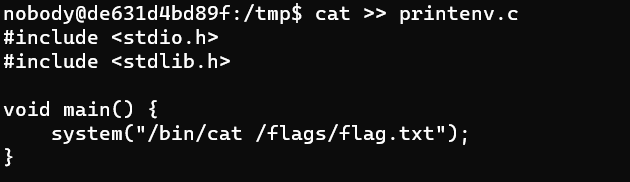
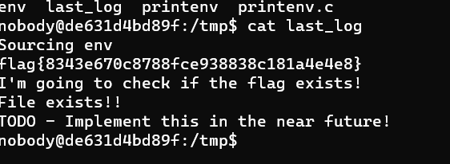

## CTF EXTRA - British Punctuality

### Walk through: 
By analyzing cronjobs which is a source of vulnerabilities and also taking into count the CTF name we could see that in cron.d there was a script named **my_cron_script.sh** that was always being executed with flag_reader permissions that would output the results of the **/home/flag_reader/my_script.sh** into **/tmp/last_log** file. 
Consequently, by visualizing the contents of the **my_script.sh** file we could see that it checked for the existance of a file on the **/tmp/env** path through the **-f flag** and it would execute the content of its file via **xargs**. Finally it would execute the printenv command. So by taking a look at the behaviour of **my_script.sh** we could manipulate the printenv binary, once a fullpath was not given.
Finally, in order to manipulate the binary it was necessary to change the search of the binary by changing the **PATH** enviroment
variable to **/tmp** which was the only folder we had write, read and execute permission on. So, we created a new file named 
env with only a simple line inside it which was: **PATH=/tmp/** which would make **tmp** the first folder where the **O.S** would search for **binaries** first. Lastly, we wrote a simple **program in C** (but it could be made through bash scripting too) that would **print the contents inside the /flag/flags.txt file**, once the program was being executed with **flag_reader user permissions** at every second which had read permissions on the flag folder and its files. Finally, by visualizing the content of **last_log** file we could visualize our **flag** instead of the enviroment variables thanks to the **PATH** enviroment variable manipulation.

SCREENSHOTS OF THE PROCESS: 

