# Log Book 11

## Task 1

### What part of the certificate indicates this is a CA’s certificate?
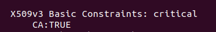

### What part of the certificate indicates this is a self-signed certificate?
The Issuer is the same as the Subject.

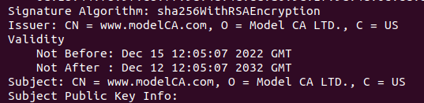

### In the RSA algorithm, we have a public exponent e, a private exponent d, a modulus n, and two secret numbers p and q, such that n = pq. Please identify the values for these elements in your certificate and key files.

- Public exponent, e:


- Private exponent, d:

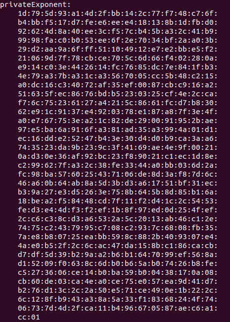

- Modulus, n:
  
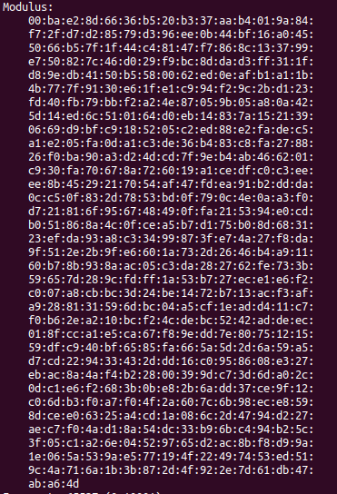

- To find the private key, we need to find the two secret numbers p and q, such that n=p*q:
  - p:
    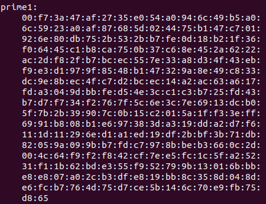
  - q:
    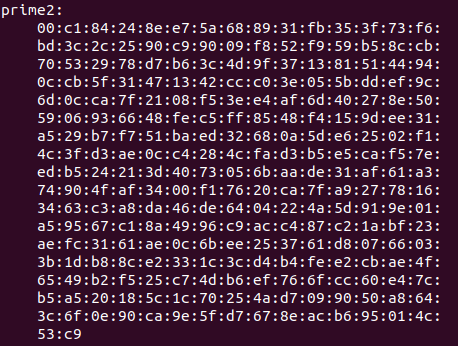 

## Task 2
We generated the certificate signing request (CSR).

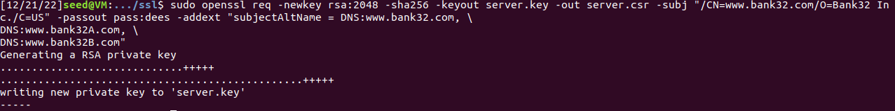

## Task 3
We generated the certificate.

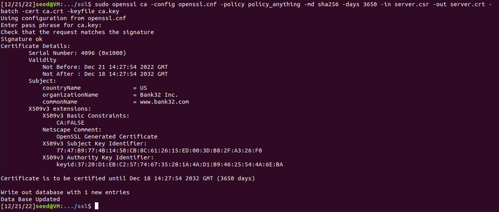

Print of the decoded content of the
certificate:

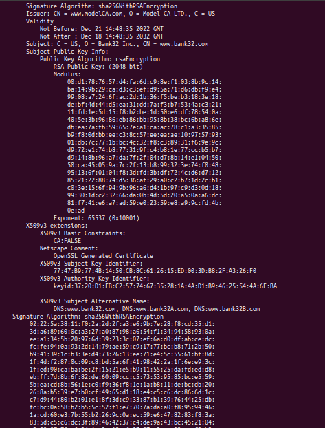

## Task 4
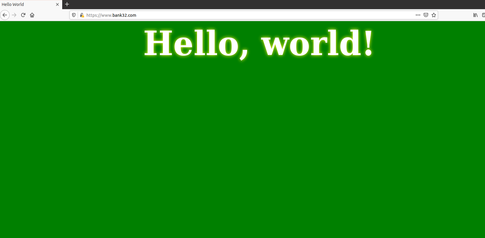
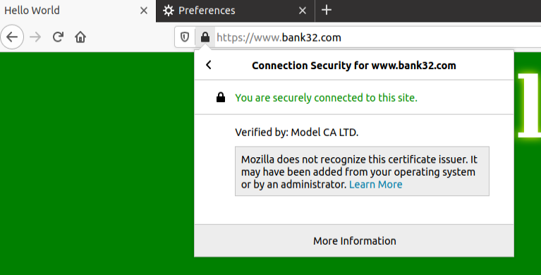

## Task 5
ServerName was changed to ```fe.up.pt```. ```10.9.0.80 fe.up.pt``` was added to ```/etc/hosts```.
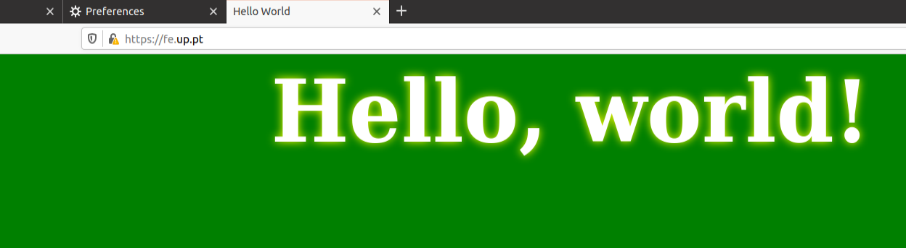

## Task 6
When the CA is compromised, we can sign certificates ourselves and impersonate other websites. In this case, we're impersonating ```fe.up.pt```.


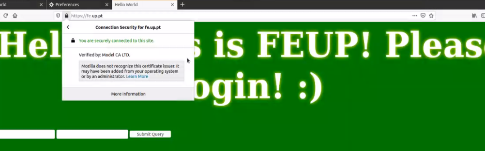

---

## CTF 11
### Challenge 1

No primeiro desafio o objetivo é decifrar uma mensagem RSA sendo nos dado indiretamente o valor de p e q e o e é padrão.

Primeiramente, descobrimos p e q. A estratégia utilizada foi o teste de primalidade de Miller-Rabin que diz se um número tem uma boa probabilidade de ser primo, uma vez que com número com tantos digitos verificar com 100% de certeza levaria algum tempo.


Com estes dois números, consegui-mos facilmente calcular o (p-1)(q-1) e por consequente o d.
´
O resultado foi o seguinte: 


