# Log Book 4

## Task 1
An environmental variable is a variable that is available system wide. As we can see in the screenshot above by using the "printenv" command it prints all the environments variables and their current assigned values. For example, the Shell environment variable is assigned to the location of the bash executable ie the location where the bash gets "spawned".
In addition, PWD has a value assigned of /home/seed which corresponds to the current user working directory.
Finally, using env | grep <name of the environment variable> we can see the value of the desired environmental variable. For example, the env | grep command gives us the old current working directory (old value of the environment variable) and the current working directory (the new/current value). In addition, the env command can run other commands with modified environments.

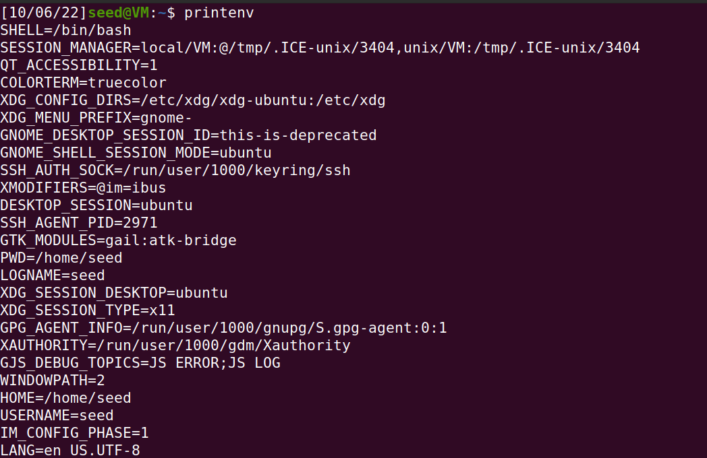
> Screenshot of the printenv command outcome
    
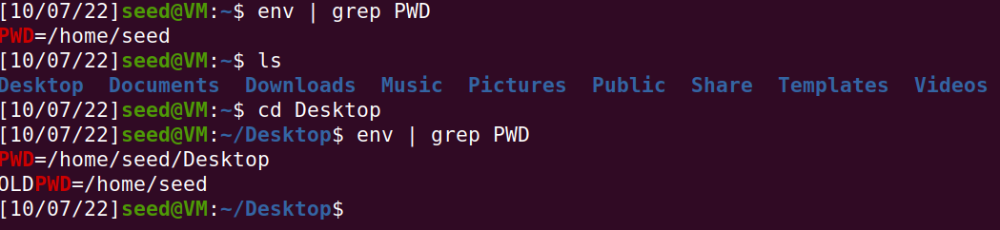
> Screenshot of the env command outcome
    
Lastly by using the export and unset commands is possible to set and unset environment variables like PWD which has the value of the current working directory. Also the pwd command doesn't get affected by the deletion of the PWD environment variable, as you can see on the following screenshot: 
    
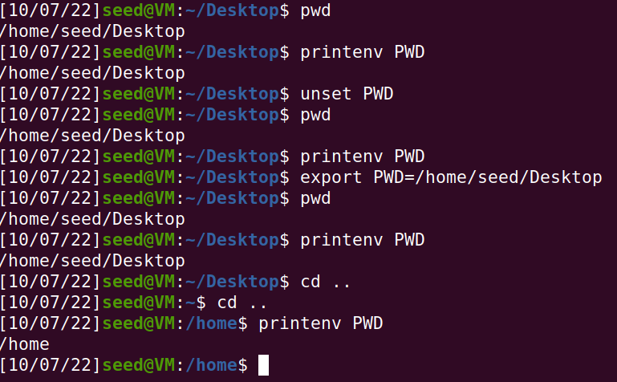
> Screenshot of the usage of export and unset commands

## Task 2
   
### Step 1

- After reading the fork manual as well as compiling and running the myprintenv program we concluded that this program would do the same as the myprintenv command or env command on the terminal. In this case, it would print the child process environment variables, once the code was being executed in the case 0, which is equal to the child process when the return of the function fork is equal to 0.
    
### Step 2 

- After commenting the lines related to the child process and uncommenting the ones related to the parent process it was possible to conclude that the program was outputting the environment variables of the parent process, which seemed to be the same environment variables as in step #1.
    
### Step 3 

- Finally, using the diff command was possible to conclude that there was not difference between the parent process and the child process environment variables, so we concluded that parent's environment variables are inherited by the child process.

## Task 3
##### The code in **myenv.c** executes a program called /usr/bin/env which prints out the environment variables of the current process.
##### This is achieved by calling **execve()** that has:
* The <ins>**filename**</ins> of the file that contains the executable image of the new process in it's first argument.
* <ins>**argv[]**</ins> in it's second argument - <ins>**argv[0]**</ins> is required and must contain the name of the executable file for the new process image. In <ins>**argv[1]**</ins> a NULL pointer is used to mark the end of the array.
* In the third argument the function receives <ins>**envp**</ins> which is an array of pointers that each character string pointed to by the array is used to pass an environment variable to the new process image.

##### **Step 1:** At first we don't get any output by compiling and running the code because <ins>**envp**</ins> is NULL.

> 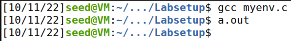

_`Screenshot of myenv output with envp as NULL.`_

##### **Step 2:** Change <ins>**envp**</ins> from NULL to environ in the function call.

>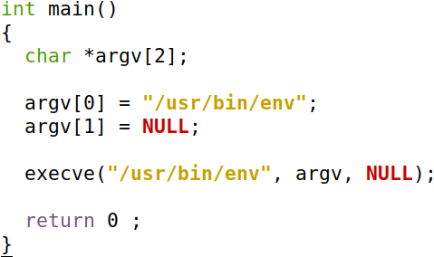<br>

_`Screenshot of myenv.c before editing envp from NULL to environ.`_

>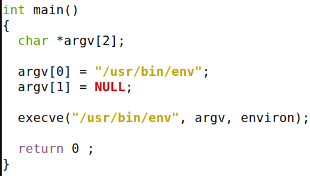<br>

_`Screenshot of myenv.c after editing envp from NULL to environ.`_


##### **Step 3:** After all the changes, the program prints out all the existing environment variables.

>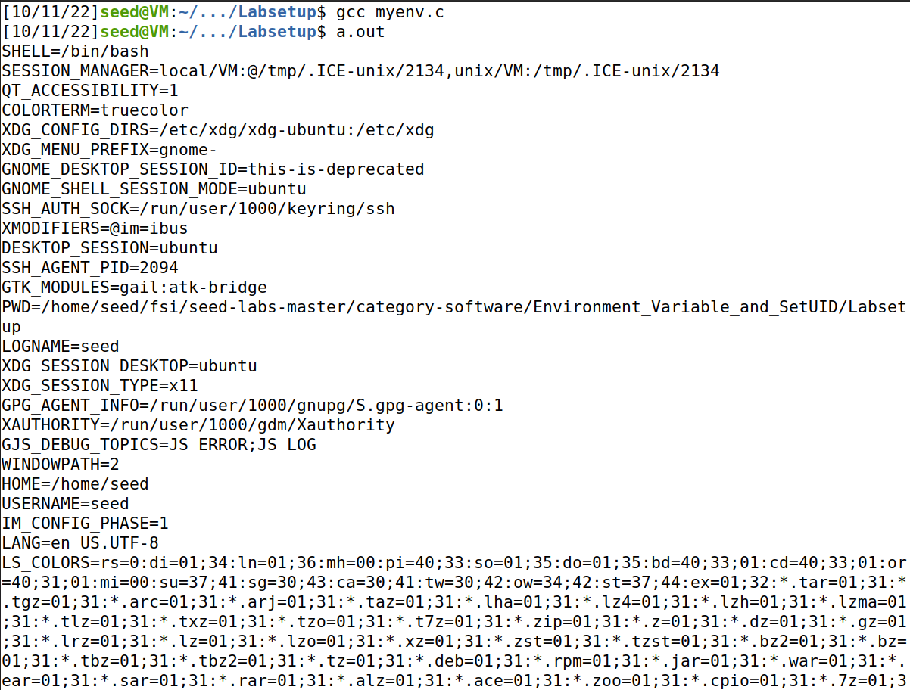<br>

_`Screenshot of myenv output with envp as environ.`_

## Task 4
##### In this task, we study how environment variables are affected when a new program is executed via the `system()` function. This function is used to execute a command, but unlike `execve()`, which directly executes a command, `system()` actually executes _"/bin/sh -c command"_ i.e., it executes /bin/sh, and asks the shell to execute the command.
>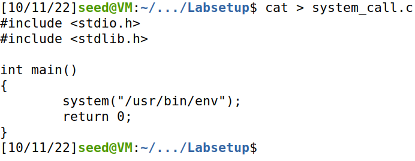<br>

_`Screenshot of writing system_call.c.`_

>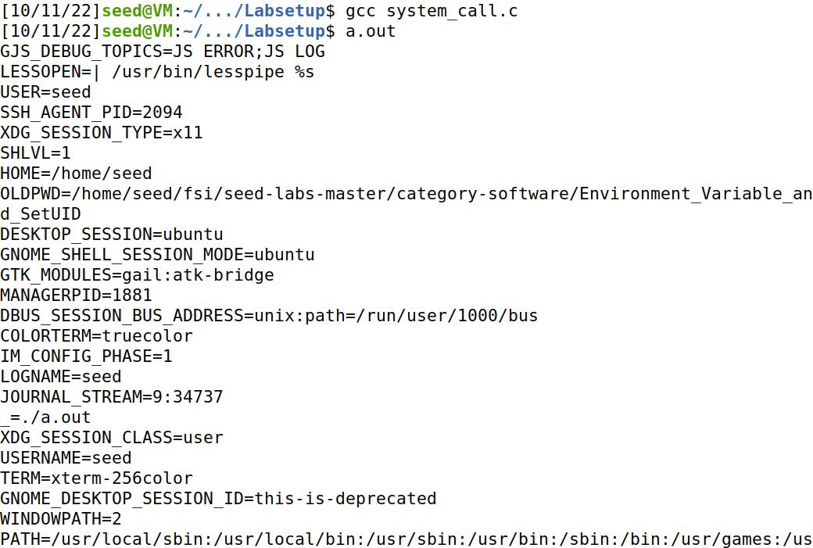<br>

_`Screenshot of executing system_call.c.`_

## Task 5

### Step 1

When running the given code with the default environment variables and no arguments, the program prints to ```stdout``` all the environment variables of the default user. Since we are testing the program on Seed-Ubuntu, the default user is **seed**.

### Step 2

After compiling the program ```foo.c``` with ```gcc```, we get an executable file ```foo```:

```bash
$ gcc -Wall -o foo foo.c
```

Now we can run the following commands for the executable file:

```bash
$ sudo chown root foo
$ sudo chmod 4755 foo
```

Since both these commands require extra privileges, we need to use ```sudo``` to run them.
- The ```chown``` command allows to change the ownership of the executable file to another user, in this case ```root```.
- The ```chmod``` command allows to give read, write and execution permissions. The first digit of ```4755``` sets the ```setuid``` flag. When it is set, it will set the permissions of the user executing the file to the permissions of the owner of the file, which, due to ```chown``` command, happens to be ```root```. In this case the command gives:
    - read, write and execution permission to the owner(7);
    - read and execute permissions to the group and others (55).

The following image shows the permissions for the executable file ```foo```:

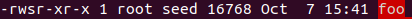

### Step 3

We used the command ```export``` to set the following environment variables:

```bash
$ export PATH="/usr/bin/"
$ export LD_LIBRARY_PATH="/lib/"
$ export TEST="this_is_a_test"
```

With the following images, we can conclude that both ```PATH``` and ```TEST``` variables remain the same but the ```LD_LIBRARY_PATH``` isn't inherited when running the program.

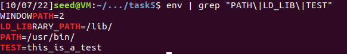
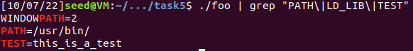

## Task 6

By executing the following program given by Seed Labs, we can see that it calls ```ls``` using the ```PATH``` environment variable:

```C
#include <stdio.h>
#include <stdlib.h>

int main() {
  system("ls");
  return 0;
}
```
After compiling and changing the ownership and permissions of the executable file, we obtained the following output:

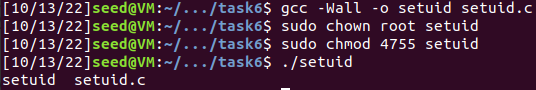

Now we create a new program that contains malicious code:

```C
#include <stdio.h>
#include <stdlib.h>
#include <unistd.h>

int main() {
  fputs("This is a malicious code\n", stdout);
  execl("/bin/whoami", "", (char *) NULL);
  return 0; // unreachable
}
```

When we manipulate the ```PATH```, we can make it run our malicious code instead. The following image shows the output of the program:

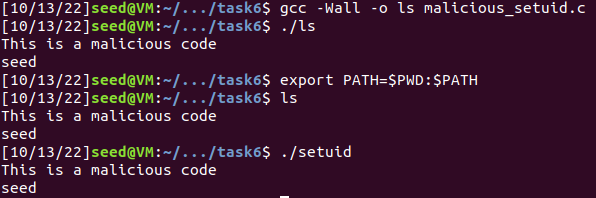


---

## CTF 4

- **Wordpress version**: 5.8.1
- **Installed plugins + version**: Woocommerce 5.7.1
- **Possible users**: admin, Orval Sandford

This vulnerability is identified by the CVE-2021-34646.
It has a CVSS score of 7.5 and it's type is *Bypass a restriction or similar*. ([CWE-330](https://cwe.mitre.org/data/definitions/330.html))
More information about this vulnerability can be found [here](https://cve.mitre.org/cgi-bin/cvename.cgi?name=CVE-2021-34646) and [here](https://www.cvedetails.com/cve/CVE-2021-34646/?q=CVE-2021-34646).

After finding the CVE, we could search it in a exploit database. In this case we used [this](https://www.exploit-db.com/exploits/50299) database, where we found a exploit code that would help us break into the admin account without needing any kind of log in verification.

The program just needed the target website and a user id to run, and since we want to attack the admin account, we figured the user id must be either 0 or 1.
After running the given Python program, we obtained the following output:
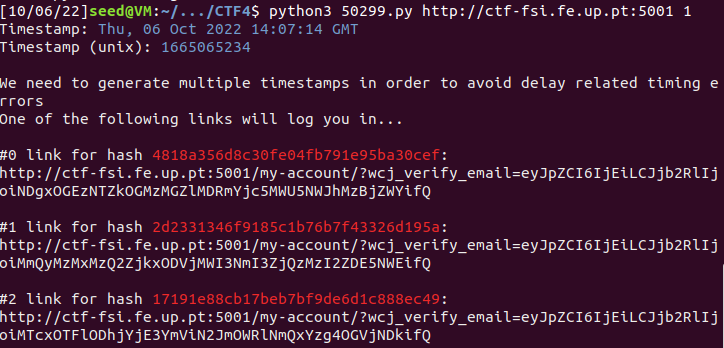

Then, all we needed to do was access the target website with the url generated by the program and we are inside the admin account.

After browsing through the website in admin mode, we found a private post that had the flag of the CTF.
