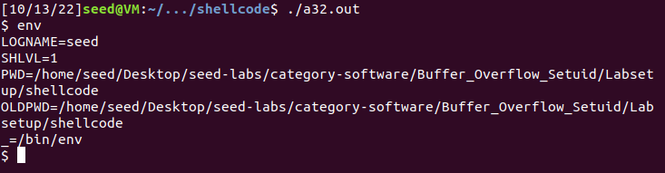
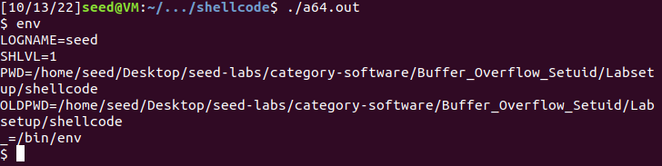
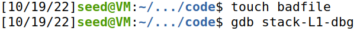
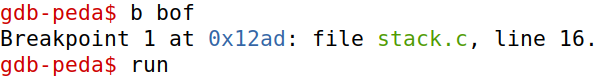
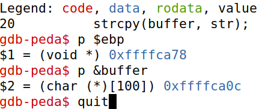
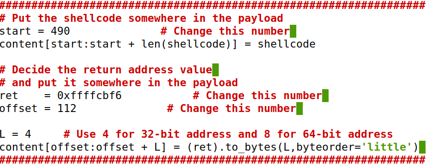
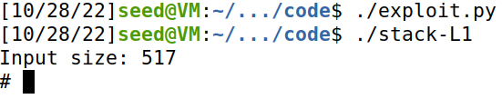
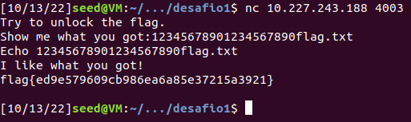
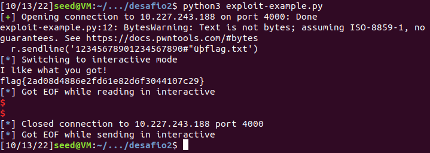

# Log Book 5

## Environment Setup
### Turning off countermeasures
For this lab, we need to disable security mechanisms that make buffer-overflow attacks more difficult.

#### Address Space Randomization
Deactivates address space randomization making guessing addresses more easier to be able to do a buffer-overflow attack.

```bash
$ sudo sysctl -w kernel.randomize_va_space=0
```

#### Configuring /bin/sh
Links the ```/bin/sh``` to another shell that does not have the security countermeasure that bash uses that prevents itself from being executed in a Set-UID process.

```bash
$ sudo ln -sf /bin/zsh /bin/sh
```

#### StackGuard and Non-Executable Stack.
Deactivates two more countermeasures implemented in the system. They will be turned off during compilation.

## Task 1

To compile the shell code given by Seed, we used the Makefile also given by Seed. It generates two executable files, one being a 32-bit shell and another being a 64-bit shell.
When executed, both binary files open a shell. These shells support running commands as usual, but deleting characters doesn't give visual feed. Deleting a char from the command line deletes it from the buffer, but it remains on screen.

The following images show the environment variables of both shells:




As we can see from the images, these shells include both a ```PWD``` and ```OLDPWD``` and a ```SHLVL``` variable, but there's no ```PATH``` variable defined.

## Task 2
In this task we have a file named stack.c which has a buffer overflow vulnerability. Firstly, we open a file named "badfile" and copy its first 517 characters to a char array named str. After that we invoke the dummy function passing by argument the string buffer which then calls the bof function which uses the strcpy function to copy the string buffer content to another char buffer with only 100 characters capacity. Once, strcpy has no boundary check it would originate a buffer overflow, once we are copying a larger sized string to a smaller sized one. Lastly, by manipulating badfile, e.g writing 100 characters and after that shellcode we could exploit this buffer overflow due to the bof strcpy vulnerability and gain the root privilege due to this Set-UID bit being set.

## Task 3
### Investigation
To exploit the buffer-overflow vulnerability in the target program, the most important thing to know is the distance between the buffer’s starting position and the place where the return-address is stored. We will use a debugging method to find it out.  Since we have the source code of the target program, we can compile it with the debugging flag turned on. That will make it more convenient to debug.
We will add the **-g** flag to gcc command, so debugging information is added to the binary. We need to create a file called badfile before running the program.







The program stops inside the bof function due to the breakpoint created, we then printed out the ebp and buffer values as shown in the previous screenshots.

### Launching Attacks
After having all the informations needed we can now create our exploit using the script exploit.py.



- **Shellcode:** We write the shellcode that we want to use for the attack.

- **Start:** Since the buffer has 517 bytes and the shellcode has 27 bytes, we utilize 517-27 = 490 as our start value to put the shellcode at the end of the buffer.

- **Ret:** Considering the buffer starts at 0xFFFFCA0C and has a size of 517, the retturn address we chose was 0xFFFFCA0C - 490 = 0xFFFFCBF16.

- **Offset** Since that 0xFFFFCA78 (ebp address) - 0xFFFFCA0C (buffer address) = 108, we conclude that the ebp starts 108 bytes after the buffer. Because it has a size of 4 bytes, our offset must be 108 +  4 = 112. 




## Task 4 (optional)

## Task 5 (optional)

---

## CTF 5

### Challenge 1

#### **Is there a file that is opened and read by the program?**
Yes, the program stores the name of the file (```mem.txt```) on a buffer (```meme_file```). Then it proceeds to open the file on a reading mode with the function ```fopen```.

#### **Is there any way to control which file is opened?**
Since the program does not create the file that it uses, it is possible to change the target address and control which file is opened.

#### **Is there any buffer-overflow? If yes, what can you do?**

The array of chars ```buffer``` only has 20 memory positions, however, when ```scanf``` is executed, it reads up to 28 characters and stores them in ```buffer```. Because of this, there is a buffer-overflow that we will use to obtain the flag for the challenge.



### Challenge 2

This challenge is similar to the first one, it also is a buffer overflow vulnerability that can be exploited to overwrite the content of local variables.

Differences to the first challenge:
- Although the size of the array of chars ```buffer``` is still 20, the function ```scanf``` now reads up to 32 characters and stores them in ```buffer```.
- There's an extra step of security in this challenge. The introduction of a key variable that needs to be matched to access the functionality of file dumping. The key, hexadecimal ```0xfefc2223``` can be manipulated by changing the content of ```val```.

Even with these differences the main goal of the challenge is still the same: cause buffer-overflow by overwriting local variables (in this case, ```val``` and ```meme_file```).

Like in challenge 1, there is a piece of code that dumps the content of a file based on the content of ```meme_file```, we need to change its value to ```flag.txt``` to dump the content of the flag file.

Using an online hexadecimal converter to ASCII, we discover the ASCII representation for ```0xfefc2223``` is: ```þü"#```

This is the string payload that we need to inject to crack the key countermeasure. One subtle trick that took us some time to overcome was the need to convert ```0xfefc2223``` representation to little-endian. This way the string needs to be reverted ```#"üþ```


